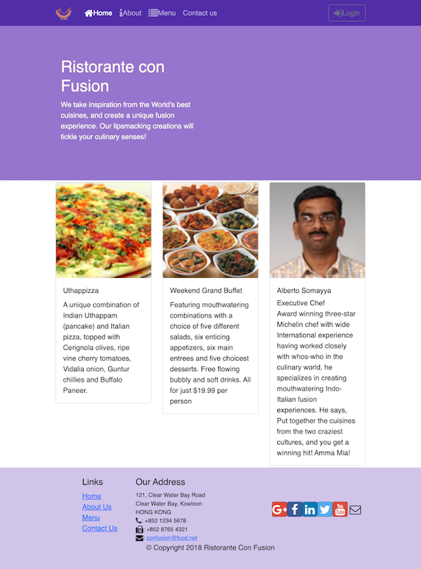
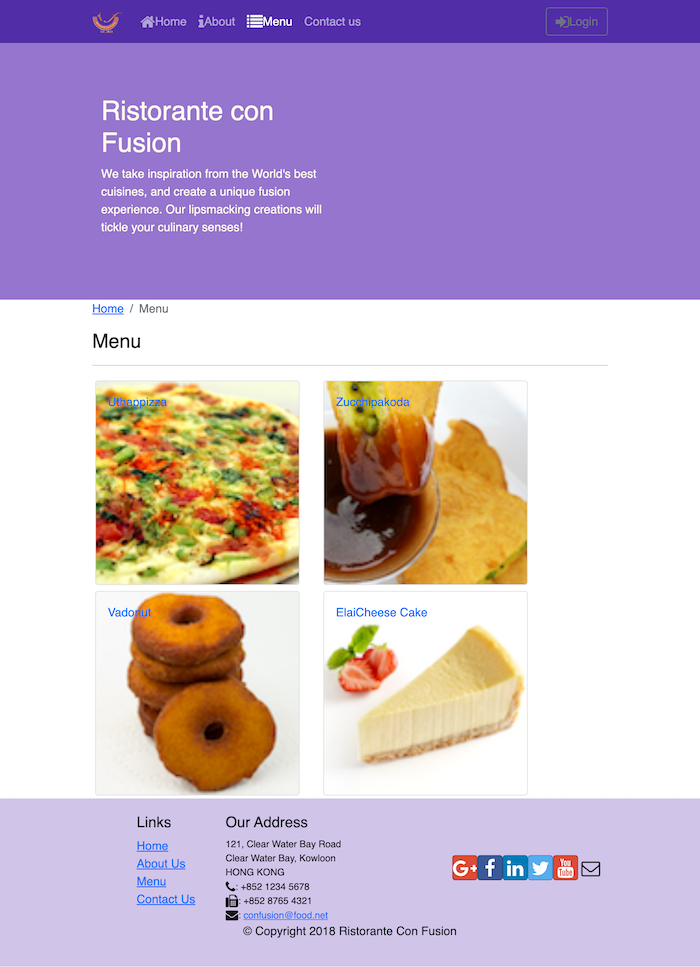
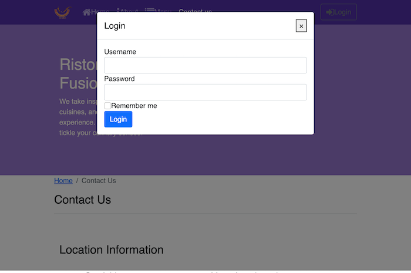
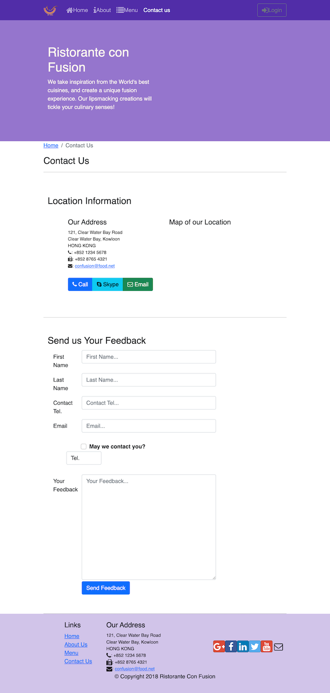
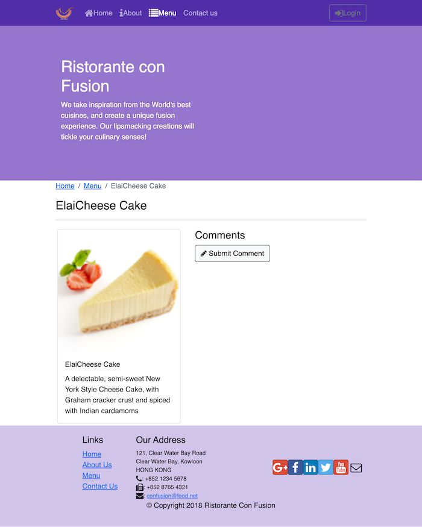

  <h1>Confusion Resturant App (Front End)</h1>
  

    <h2>Demo</h2>
    
    
    
    
    
  

  <section >
    <h2 >Description</h2>
    Front End Designed website for a italian resturant.
    The website looks amazing.
    Completed between 2 to 3 days to be completed, as there is nothing complicated that needed to be done.
    <a href="https://github.com/snipersenpai/conFusionServer.git">Node & Exxpress Backend Server</a>
  </section>
  <section >
    <h2 >Developer Team</h2>
    <ul >
      <li >
        Fully Developed By Me
      </li>
    </ul>
  </section>
  <section >
    <h2>Technologies Used</h2>
    

      <ul >
        <li>
          Bootstrap(reactstrap)
        </li>
        <li>
          Node
        </li>
        <li>
          MongoDB
        </li>
        <li>
          Express
        </li>
        <li>
          React
        </li>
      </ul>
    

  </section>
  <section class="col-12">
    <h2>App Features</h2>
    

      <ul>
        <li>
          Home/Landing Page with resturant summary
        </li>
        <li>
          Login and Register Page
        </li>
        <li>
          Contact Us Page
        </li>
        <li>
          Menu List Page
        </li>
        <li>
          Menu Customer Comment and Rating
        </li>
        <li>
          Reservation Booking
        </li>
        <li>
          Admin Management
        </li>
      </ul>
    

  </section>
  <section class="col-12">
    <h2>For Demo</h2>
    <code>
      git clone https://github.com/snipersenpai/confusion.git
    </code>
    <code>
      npm install
    </code>
    <code>
      npm start
    </code>
  </section>

